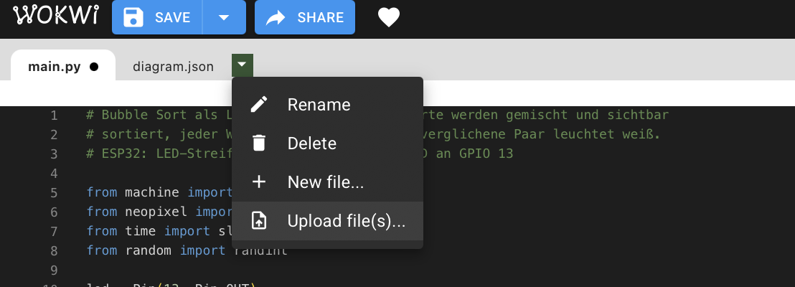
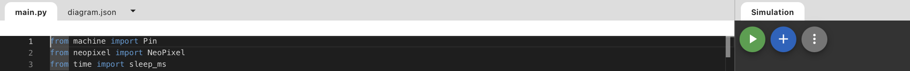
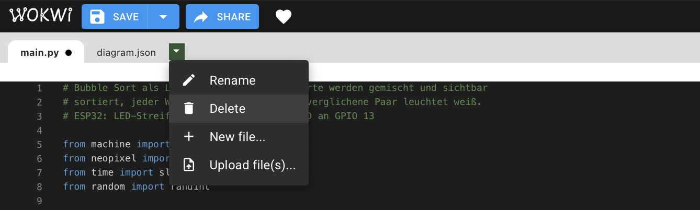

# MEINE SOL

Das ist mein Wokwi x Python x BubbleSort Projekt

## Wokwi – Kurzanleitung

### 1. Datei hochladen

Klicke auf den Pfeil neben den Dateireitern (`main.py`, `diagram.json`) und wähle **Upload file(s)…**. Danach die gewünschte Datei auswählen — sie erscheint als neuer Reiter.

### 2. Simulation starten

Oben rechts im Bereich **Simulation** auf den grünen Play-Button klicken. Der Code läuft dann direkt auf dem simulierten ESP32.

### 3. Datei löschen

Den zu löschenden Reiter auswählen, wieder auf den Pfeil klicken und **Delete** wählen.

